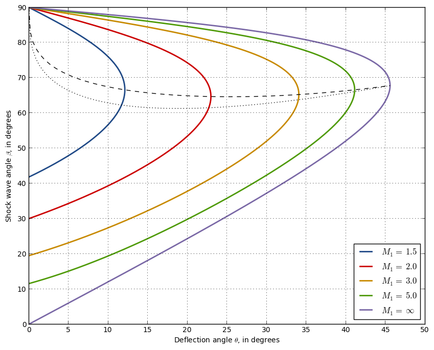

Documentation of scikit-aero
============================

**scikit-aero** is a Python package for various aeronautical engineering
calculations. It is based on several existing Python packages on the field,
but intends to provide pythonic syntax, use of SI units and full NumPy arrays
support among other things. scikit-aero is licensed under the BSD license.

It was started by Juan Luis Cano in 2012 and it is currently developed and
maintained by him. The source code and issue tracker are both hosted on
GitHub

https://github.com/Pybonacci/scikit-aero

**Notice**: This package is under heavy development and the API might change
at any time until a 1.0 version is reached. It is stable but not feaure
complete yet, and it might contain bugs.

   Oblique shock chart

User Guide
==========

This is the user guide.

.. toctree::
   user/intro
   user/installation
   user/first_steps
   user/advanced

API Reference
=============

Complete API reference.

.. toctree::
   :maxdepth: 1
   :glob:

   reference/**

Indices and tables
==================

* :ref:`genindex`
* :ref:`modindex`
* :ref:`search`
